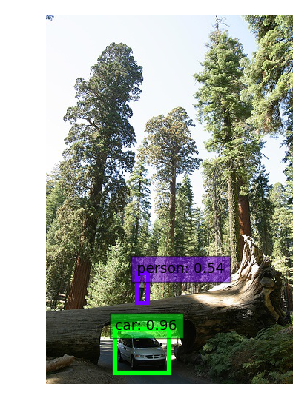

OpenDetection
=============

OpenDetection is a standalone open source project for object detection and recognition in images and 3D point clouds.

Website - http://opendetection.com or http://krips89.github.io/opendetection_docs

Git - https://github.com/krips89/opendetection

Getting started - http://opendetection.com/getting_started.html

User guide - http://opendetection.com/introduction_general.html

API Documentation - http://opendetection.com/annotated.html

Short demo video - https://www.youtube.com/watch?v=sp8W0NspY54


OD Datasets
=============

Code to provide unified api for datasets, eg. PascalVOC, ImageNet, MSCOCO.

Main code is located in common/datasets/.
Example code is located in examples/objectdetector/

### Preparation
1. To produce lmdb for object detection, now ssd-caffe(https://github.com/weiliu89/caffe/tree/ssd) is needed to install.

2. Download dataset, we now provide code for three popular datasets. Please organize the dataset as following:

Pascal VOC (2007 for example):
```Shell
voc_root
  |
  -- trainval/VOC2007
  |       |
  |       -- Annotations
  |       -- ImageSets
  |       -- JPEGImages
  |       -- SegmentationClass
  |       -- SegmentationObject
  |
  -- test/VOC2007
         |
         -- Annotations
         -- ImageSets
         -- JPEGImages
         -- SegmentationClass
         -- SegmentationObject
```


ImageNet (tiny-imagenet for example: https://tiny-imagenet.herokuapp.com, no need to modify after downloading)
```Shell
imagenet_root
  |
  -- train
  |     |
  |     -- n01443537
  |     -- n01629819
  |     -- ...
  -- val
  |    |
  |    -- images
  |    -- val_annotations.txt
  -- test
  |    |
  |    -- images
  -- wnids.txt
  -- words.txt
```

MSCOCO (2014 for examples)
```Shell
coco_root
  |
  | -- Annotations
  |     |
  |     -- instances
  |          |
  |          -- instances_train2014.json
  |          -- instances_val2014.json
  |     -- person_keypoints
  |     -- ...
  |
  |-- Images
  |     |
  |     -- train2014
  |     -- val2014
  |     -- test2014
```


  

### Examples
We provide examples to use these api (build the opendetedtion project first).


#### Apis we provide:
```Shell
# This examples will load the datasets of PascalVOC2007, tiny-imagenet and MSCOCO
cd build
./examples/objectdetector/od_load_dataset
```

#### Example to using SSD to perform object detection on PascalVOC 2007
```Shell
cd build
# prepare lmdb and files needed by ssd.
./examples/objectdetector/od_ssd_detect/preprocess  ../data/Detection/pascal/

# copy trainval.txt, test.txt and test_name_size.txt to ssd directorys. ssd_dir is the root directory you install your ssd-caffe
cp ../data/Detection/pascal/*.txt ssd_dir/data/VOC0712/

# train and test ssd in ssd directory.
cd ssd_root
python examples/ssd/ssd_pascal.py
python examples/ssd/score_ssd_pascal.py

# perform detectection using the trained model.
cd build
./examples/objectdetector/od_ssd_detect/detect
```

Detection examples of ssd:

<p align="center">



</p>

#### Example for classification on tiny-imagenet-200 dataset.
```Shell
# convert train and val subset to lmdb, and compute image mean.
cd  build
./examples/objectdetector/od_ssd_classification/prepare ../data/Classification/imagenet/

# train the model in caffe directory.
# model definition for tiny-imagenet (200 categories) has been provided in ./data/Classification/imagenet/models/bvlc_reference_caffenet/
cd caffe_dir
./build/tools/caffe train --solver=opendetection_dir/data/models/bvlc_reference_caffenet/solver.prototxt

# classify test images using the trained model.
cd build
./examples/objectdetector/od_ssd_classification/classify caffe_dir \
  ../data/Classification/imagenet/models/bvlc_reference_caffenet/deploy.prototxt \
  ../data/Classification/imagenet/models/bvlc_reference_caffenet/caffenet_train_iter_xxx.caffemodel \
  ../data/Classification/imagenet/imagenet_mean.binaryproto \
  tiny-imagenet-200_dir/synset_words.txt 
```
example of classification output:
```Shell
---------- Prediction for /path/to/data/tiny-imagenet-200/test/images/test_3956.JPEG ----------
0.3764 - "n02095889 Sealyham terrier, Sealyham"
0.1704 - "n02096437 Dandie Dinmont, Dandie Dinmont terrier"
0.0881 - "n02101556 clumber, clumber spaniel"
0.0706 - "n02091635 otterhound, otter hound"
0.0611 - "n02095314 wire-haired fox terrier"
```


